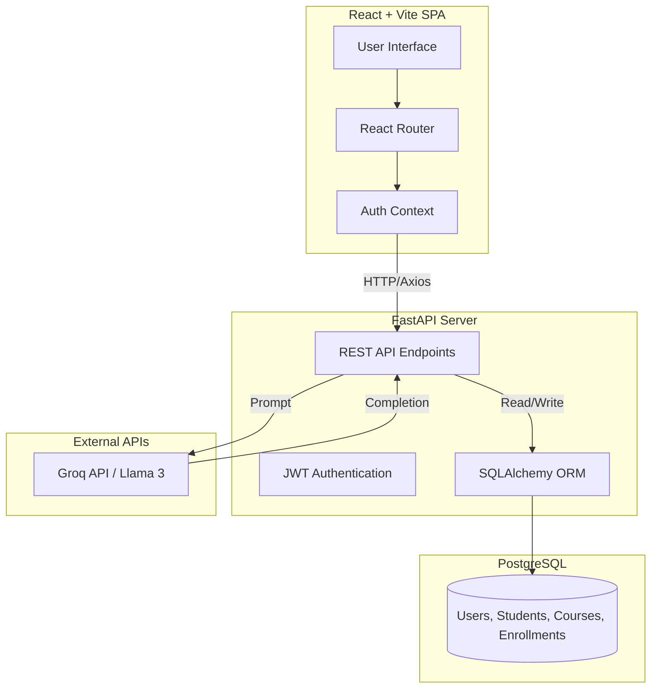

# Student Enrollment Portal

## Project Overview
The Student Enrollment Portal is a full-stack web application designed to manage university academic records. It provides an intuitive interface for university administrators to oversee student profiles, course catalogs, and enrollment records. The system also features an AI-powered Academic Advisor that answers common queries regarding university policies. This project was built to demonstrate end-to-end full-stack development, database architecture, and API integration.

## Features
- **User Authentication:** Secure JWT-based login and registration system.
- **Student Management:** Full CRUD operations for creating, viewing, updating, and removing student profiles.
- **Course Management:** Add and modify course offerings including credits and instructors.
- **Enrollment Management:** Link students to courses with duplicate enrollment prevention constraints.
- **AI Academic Advisor:** Interactive chat interface powered by Llama 3 via Groq for instant academic guidance.
- **Protected Routes:** Frontend navigation guarding requiring valid authentication.
- **Cloud Deployment:** Seamlessly deployable on Vercel (Frontend) and Render (Backend).

## Tech Stack
**Frontend:**
- React 19
- TypeScript
- Vite
- Tailwind CSS v4
- Axios
- React Router v7

**Backend:**
- FastAPI
- SQLAlchemy
- PostgreSQL

**Authentication:**
- JWT (JSON Web Tokens)

**AI:**
- Groq API (Llama 3)

**Deployment:**
- Vercel (Frontend)
- Render (Backend)
- Supabase / Neon (Database)

## System Architecture



## API Overview
The backend exposes the following RESTful groups:
- **Authentication:** `POST /auth/login`, `POST /auth/register` for obtaining JWT tokens.
- **Students:** `GET`, `POST`, `PUT`, `DELETE` operations on `/students/`.
- **Courses:** `GET`, `POST`, `PUT`, `DELETE` operations on `/courses/`.
- **Enrollments:** `GET`, `POST`, `DELETE` on `/enrollments/` linking students to courses.
- **Advisor:** `POST /advisor/chat` for submitting questions to the LLM.

## Local Development Setup

### Prerequisites
- Node.js (v20+)
- Python 3.9+
- PostgreSQL (or SQLite for local dev)

### Environment Variables
**Frontend (`.env`):**
```env
VITE_API_URL=http://localhost:8000
```

**Backend (`.env`):**
```env
DATABASE_URL=sqlite:///./sql_app.db
SECRET_KEY=your_super_secret_key
GROQ_API_KEY=your_groq_api_key
```

### Backend Setup
1. Navigate to the backend directory:
   ```bash
   cd student-enrollment-api
   ```
2. Create and activate a virtual environment:
   ```bash
   python -m venv venv
   source venv/bin/activate
   ```
3. Install dependencies:
   ```bash
   pip install -r requirements.txt
   ```
4. Start the FastAPI server:
   ```bash
   uvicorn app.main:app --reload
   ```

### Frontend Setup
1. Navigate to the frontend directory:
   ```bash
   cd student-enrollment-frontend
   ```
2. Install dependencies:
   ```bash
   npm install
   ```
3. Start the Vite development server:
   ```bash
   npm run dev
   ```

## Deployment

### Database Deployment (Supabase/Neon)
1. Provision a PostgreSQL database on Supabase or Neon.
2. Copy the connection string.

### Backend Deployment (Render)
1. Connect the backend repository to Render.
2. Set the `Build Command` to `pip install -r requirements.txt`.
3. Set the `Start Command` to `uvicorn app.main:app --host 0.0.0.0 --port $PORT`.
4. Add the `DATABASE_URL`, `SECRET_KEY`, and `GROQ_API_KEY` to the Environment Variables.

### Frontend Deployment (Vercel)
1. Import the frontend repository into Vercel.
2. Add the `VITE_API_URL` environment variable pointing to the deployed Render backend URL.
3. Deploy. Vercel automatically detects the Vite configuration and builds the project.

## Project Structure
```text
student-enrollment-frontend/
├── public/
├── src/
│   ├── assets/
│   ├── components/
│   │   └── Navbar.tsx
│   ├── context/
│   │   └── AuthContext.tsx
│   ├── pages/
│   │   ├── Advisor.tsx
│   │   ├── Courses.tsx
│   │   ├── Dashboard.tsx
│   │   ├── Enrollments.tsx
│   │   ├── Login.tsx
│   │   ├── Register.tsx
│   │   └── Students.tsx
│   ├── services/
│   │   └── api.ts
│   ├── types/
│   │   └── index.ts
│   ├── App.css
│   ├── App.tsx
│   ├── index.css
│   └── main.tsx
├── .gitignore
├── eslint.config.js
├── index.html
├── package-lock.json
├── package.json
├── README.md
├── tsconfig.app.json
├── tsconfig.json
├── tsconfig.node.json
├── vercel.json
└── vite.config.ts
```

## Future Improvements
- Implement Role-Based Access Control (RBAC) to separate Admin, Teacher, and Student views.
- Add advanced course search, filtering, and pagination.
- Create automated email notifications for enrollment confirmations.
- Build a graphical analytics dashboard for enrollment trends.

## Learning Outcomes
By building this project, I gained practical experience in:
- **REST API Development:** Designing clean, resource-oriented endpoints with FastAPI.
- **Database Design:** Utilizing SQLAlchemy ORM to manage complex relational data and constraints.
- **Authentication:** Implementing secure, stateless JWT authentication.
- **Frontend-Backend Integration:** Connecting a React Single Page Application to an external API via Axios interceptors.
- **Deployment:** Containerizing and deploying full-stack architectures across Render and Vercel. 
